<!-- This file is rendered by https://github.com/BlvckBytes/readme_helper -->

# ItemPredicateParser

<!-- #toc -->

## Things To Think About

- Write documentation about how to use it
- The predicates and the IntegerToken could use some test-cases too

## Language Files

All words which can be matched against are pulled out of Mojang's vanilla language file,
in order to provide the best user-experience. Somebody who plays Minecraft is familiar
with the wording used by the client, while cryptic internal keys or enumeration-names may
add a needless layer of indirection to the expression.

### Word Spacing

Spaces ` ` or underscores `_` are replaced by hyphens `-`, as to not interfere with the
space-separated nature of minecraft commands, as well as to result in uniform notation.

### Collision-Prefixes

Within the german language, for example, the potion-effect `Strength` and the enchantment
`Power` are both translated simply as `Stärke`; when matching against the latter, the system would
not know which predicate to instantiate, so collision-prefixes are required, which come into
play once the members of two sources (enchantments, effects, materials, etc.) collide. These
prefixes are of course fully configurable; as an example, they could be `[Enchantment]-` for
enchantments, and `[Effect]-` for potion-effects; the desired member can now simply be selected
using syllable patterns - `stär-eff` or `stär-ench`.

## Grammar

### Syllables

The key building-block of this schema is the syllable; before it can be introduced,
the concepts of digit and letter are to be defined first.

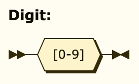

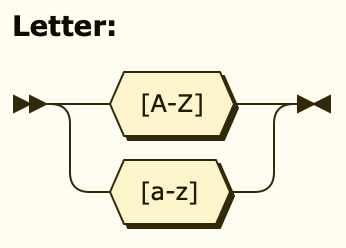

Casing is always ignored when matching on names within the translation-file. The syllable
now represents a part of the word which is to be matched against.

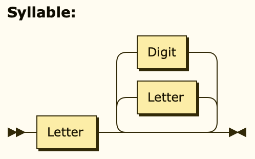

To create a search-pattern which results in the shortest match, syllables are stringed
together using the hyphen `-`; if a syllable should not be present, but instead absent,
negate it by prepending a bang `!`.

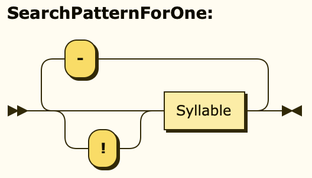

If not only the shortest match is to be used, but all names which satisfy the pattern,
exactly one question-mark `?` syllable is to be added; note that this behavior only works
with the material predicate, as it doesn't make sense elsewhere.

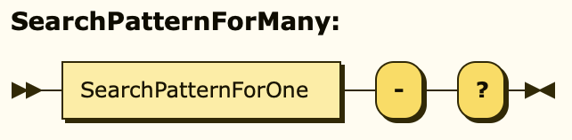

#### Examples

- `Unbreaking` <=> `unbr`
- `Fire-Protection` <=> `fir-prot`
- `Diamond-Chestplate` <=> `dia-ches`
- `Regeneration` <=> `regen`
- `Instant-Damage` <=> `ins-dam`
- `sign-?` => All signs of all wood-types, including hanging signs
- `sign-?-!han` => All signs of all wood-types, excluding hanging signs
- `wool-?` => All wools of all colors
- `glass-?` => All glass-types of all colors, including panes and bottles
- `glass-?-!pan-!bot` => All glass-types of all colors, excluding panes and bottles

### Numeric Arguments

The only type of arguments to predicates are numeric, namely of integer type. There is no need
to make use of decimals (floating-point) notation, as of now.

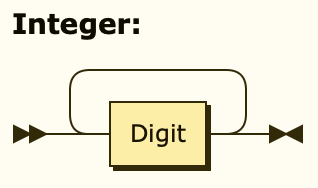

If applicable, a greater-than `>` or less-than `<` symbol can be optionally prepended to an integer
argument to specify a range of target values.

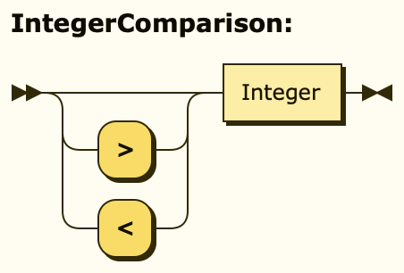

For time-spans, as in potion-durations, numbers may be separated by colons `:`, where each group is
multiplied by its corresponding power of `60`. For Example: `8:30 = 8*60 + 30`. The maximum number of
colon-separated groups is three, as in `h:m:s`, with the option to omit `m` if it's zero - for
example: `1::50 = 1*60*60 + 50`, representing 1h and 50s.

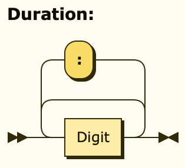

### Item Predicates

A predicate encapsulates validations which can then test any given item.

#### Amount

Checks against the stack-size.

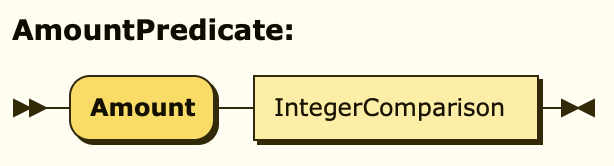

#### Material

Checks against the type of item.

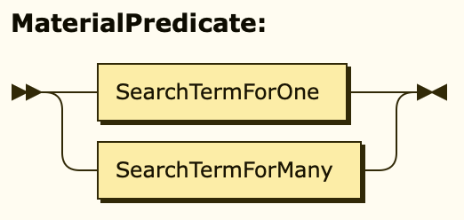

#### Deterioration

Checks against how far, in percent, the item has been used up. Takes two optional arguments; if both
are omitted, it matches against items which can experience deterioration; the first represents the
minimum amount of deterioration; the second represents the maximum amount of deterioration; both
arguments support wildcard notation.

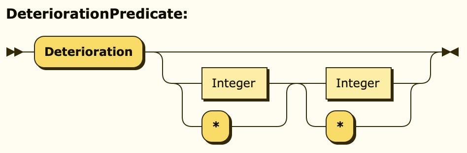

#### Enchantment

Checks against the presence of an enchantment and, if applicable, it's level. Takes one optional
argument; if omitted, it matches against all levels; supports comparison notation to specify a
range of accepted levels; supports wildcard-notation, but is advised to just be left out if not required.

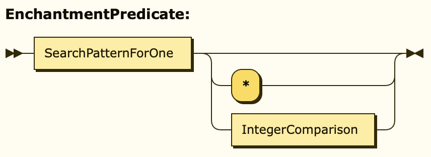

#### Potion Effect

Checks against the presence of a potion effect and, if applicable, its amplifier (stage) as well as
its duration. Takes two optional arguments; if omitted, it matches against all stages and durations; the
first argument represents the stage and supports comparison- as well as wildcard notation; the second stands
for effect duration and supports duration- as well as wildcard notation, but it is again advised to just be
left out if not required.

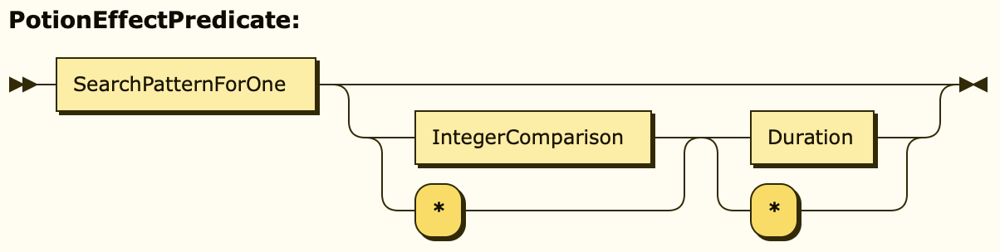

#### Text Search

Searches through the custom display-name and lore-lines (lines below the display-name), if existing, as well
as through book-authors, book-pages, book-titles and head-owner-names. Ignores colors and casing. Text searches
are encapsulated by double-quotes `"` in order to differentiate them from syllable-patterns. If the double-quote `"`
itself is to be included within the text search, prepend it by a backslash, as to mark it as a non-terminator.

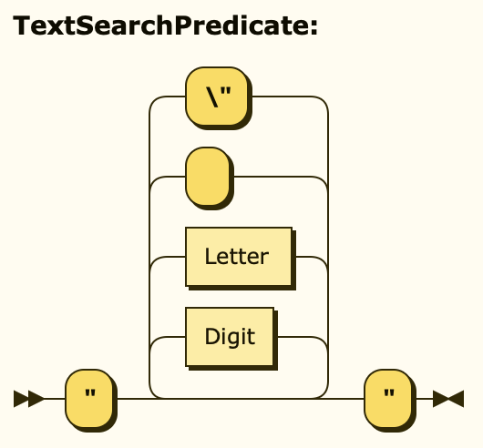

### Operators And Precedences

Precedence is implemented in the order of the following operators, with falling precedence; parentheses are always
evaluated first, while the disjunction (or) is evaluated last.

#### Parentheses

A pair of parentheses can be wrapped around any expression in order to define it as a logical "unit" and thereby
mark precedence explicitly, as desired.

#### Exact Mode

The exact-mode operator may be applied to a single predicate, simply by prepending, or to another expression, through
the use of parentheses. When a predicate is evaluated in this mode, it only matches if there are no remains of its category
left. As an example, the predicate `Unbreaking` will yield all items which contain this enchantment, but also those, that
contain others; while in exact-mode, only those who carry nothing but unbreaking on them will match; the expression
`exact( unbreaking and thorns )` will yield all items which contain only unbreaking and thorns, both at the same time, while
`exact( unbreaking or thorns )` will yield those which contain either only unbreaking or only thorns.

#### Negation (Not)

Negates the result of its operand; can be applied to a single predicate, simply by prepending it, or to another expression,
through the use of parentheses.

#### Conjunction (And)

Requires that the result of both it's left- and right-hand-side predicates or expressions are satisfied.

#### Disjunction (Or)

Requires that either the result of it's left- or right-hand-side predicate or expression is satisfied.

### Implicit Operators

If no operator is specified, predicates or expressions are implicitly and-ed together. While this feature allows for concise
notation on simple expressions, it is most definitely advised to explicitly state the desired operator once the level of
complexity reaches a certain threshold, as to avoid unintentional misinterpretation by the parser. Examples of this are as
follows: `unbreaking 2 thorns 3` <=> `unbreaking 2 and thorns 3`, `(unbreaking or thorns) (diamond-pickaxe or iron-pickaxe)`
<=> `(unbreaking or thorns) and (diamond-pickaxe or iron-pickaxe)`.